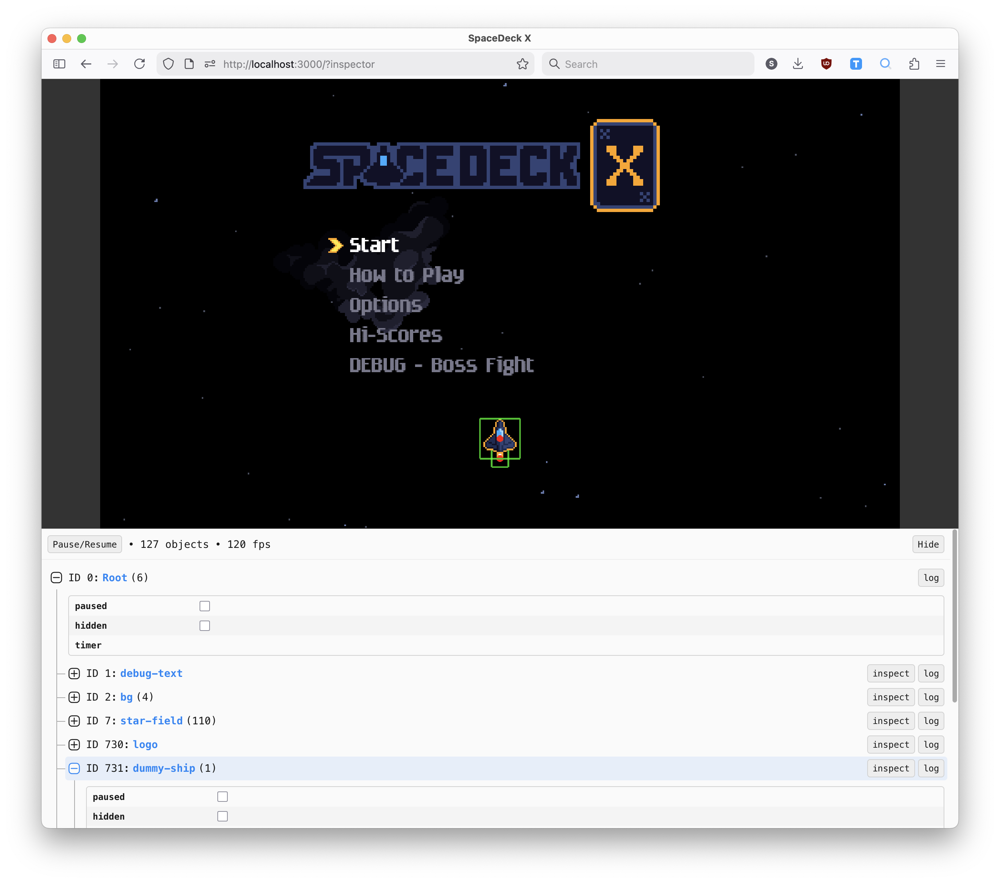

# Kaplay Inspector

A dev tool for [Kaplay](https://kaplayjs.com/) which allows you to explore and inspect the game object tree real time.



## Features

- Navigate the game object tree
- Updates every 100ms (configurable) 
- Hover an object to draw it's area, anchor and bounding box
- Inspect object's component and custom props
- Log an object to console
- Tweak position and text
- Pause an object
- Dark theme (is this a feature?)

## Usage

Install it:

```sh
npm install @stanko/kaplay-inspector
```

This is a dev tool, so I strongly recommend you import it only in development mode. This will prevent from the inspector showing up when you ship your game to players.

If you are using vite, it exposes the dev flag in `import.meta.env.DEV`. For other bundlers check their documentation.

You'll need to import the CSS and `init` method, here is an example using vite:

```ts
import kaplay from "kaplay";

// Init you kaplay game
const k = kaplay({})

if (
  // Make sure to load it only in development mode
  import.meta.env.DEV &&
  // I like to enable it only when ?inspector is available in the URL (this is optional)
  // This gives you an easy way to enable or disable it
  new URLSearchParams(window.location.search).get("inspector") !== null
) {
  import("@stanko/kaplay-inspector/dist/styles.css");
  import("@stanko/kaplay-inspector").then(({ default: init }) => {
    // Pass the "k" instance to the inspector
    init(k);
  });
}
```

### Options

You can pass options object to the init method as a second parameter:

```ts
init(k, {
  updateTimeout: 100,
})
```

available options are:

```ts
interface InspectorOptions {
  updateTimeout?: number; // in milliseconds, default: 100
  isVisible?: boolean; // is inspector visible on load, default: true
  className?: string; // optional CSS class to add to the root element
}
```

### Positioning

By default, the inspector has `position: fixed` and it sits at the bottom of the screen. If you want to move it around, the easiest way it to pass a custom class name through the options and position it yourself.

Here is an example of what I do:

```css
body:has(.k-inspector__hide) {
  display: grid;
  grid-template-rows: 60vh 40vh;

  canvas {
    width: 100% !important;
    height: 60vh !important;
    object-fit: contain;
    display: block;
  }

  .k-inspector {
    position: relative;
  }
}
```

When inspector is visible (I check if the hide button is shown), show the game in the top and the inspector on the bottom (like in the screenshot above).


## TODO

* [ ] Bounding box - handle a case when anchor is a `Vec2`
* [ ] Controllable theme - system/light/dark. At the moment it is always matching the system.
* [ ] Filter/search
* [ ] Persist search in URL or local storage
* [ ] Collapse/Expand all button
